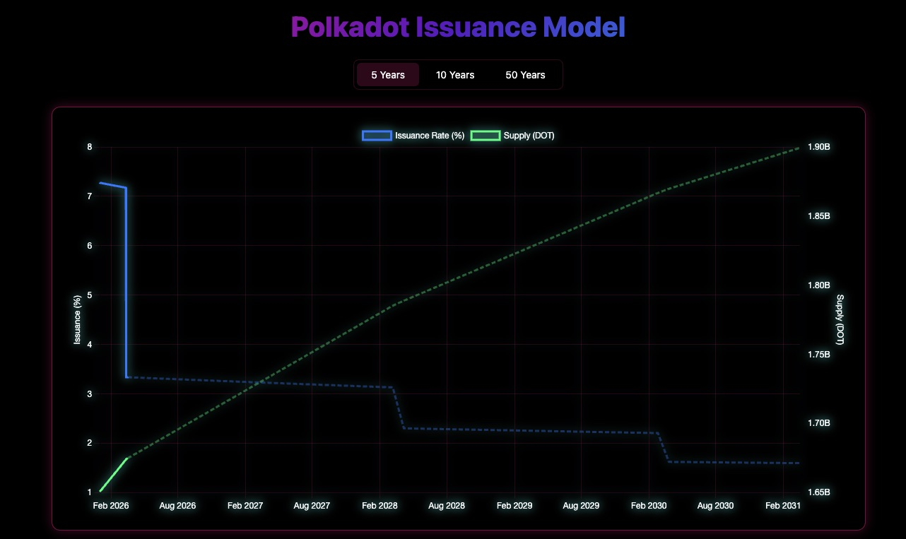

# Dotless

Polkadot inflation model visualizer live at [dotless.xyz](https://dotless.xyz).

## New Polkadot Issuance Model Is Live

Approved via Polkadot OpenGov Referendum #1710, Polkadot transitions to a capped supply model on **March 14, 2026**.

### Supply Cap

DOT supply is capped at **2.1 Billion DOT**. The previous model had no cap and issued ~120M DOT/year.

### Stepped Issuance

The new model issues **26.28% of the remaining distance to the cap every two years** (equivalent to ~13.14%/year). This works out to ~56M DOT/year in the first period (March 2026 - March 2028), an initial ~53.6% reduction compared to the previous year.

Each step moves the total supply closer to the 2.1B cap - effectively reaching it around the year 2160.

---

Tracking issue: [runtimes#985](https://github.com/polkadot-fellows/runtimes/issues/985) · Implementation: [runtimes#898](https://github.com/polkadot-fellows/runtimes/pull/898)
